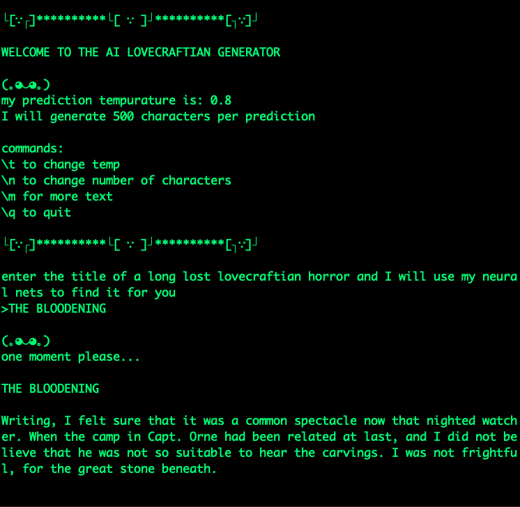

# Machine Learnng Text Generation

This is an implementation of text generation with tensorflow using `RNN`, `LSTM`, and `GRU` neural nets. There are a couple including an 'ai dictionary' word definition generator and an 'ai lovecraft' lovecraftian horror generator.

`lib.py` is one big file to make it easy to copy into a collab notebook, it can be used to trian a model on an input text dataset.

`ai_dictionary.py` and `ai_lovecraft.py` are CLI text generation programs, each trained on [Webster's Unabridged Dictionary](https://www.gutenberg.org/cache/epub/662/pg662.txt) and [H.P. Lovecraft's Corpus](https://github.com/vilmibm/lovecraftcorpus) respectively.

## Getting Started

* fork and clone this repo
* this project requires a virtual enviroment, and you can run `pip3 install virtualenv` if you don't have the virtualenv package
* cd into the repo directory and run `virtualEnv venv` to create the virtual enviroment
* run `source venv/bin/activate` to start the virtual enviroment
* run `pip3 install -r requirements.txt` to install the required packages
* due to github [file size limits](https://stackoverflow.com/questions/38768454/repository-size-limits-for-github-com), you will have to download the trained models from [this google drive](https://drive.google.com/drive/folders/1-TIM5BITbxSIGJ71q7Ai4nhJ2UqZeWS6?usp=sharing) and unzip them in the `models` folder
  
```
the file structure should look like this:
.
├── models
  ├── lovecraft_model.hdf5
  ├── websters_model.hdf5
```


* run `python3 ai_dictionary.py` to interact with the ai dictionary


* run `python3 ai_lovecraft.py` to interact with the ai dictionary



The texts gor training are stored in the `texts` directory and were retrived from [Project Gutenberg](https://www.gutenberg.org/)

Additional models can be trained by using `lib.py`

### further project ideas: 

- themed lorem ipsum rest api that generates the text on request.

- twitter bot that imitates the twitter persona of a well known personality.

- dictionary that makes a definition for a supplied word.

### todo list

- [ ] create model prediciton loop that checks predicted words against known words from the training text, and rejects unknown words (for character based generation)
- [ ] compare LSTM and GRU layers for speed and accuaracy 
- [ ] create data pipeline for tekenizing full words, treating punctuation as individual words
  - [ ] clean text of punctaion, new lines and trailing spaces better
- [ ] create pipeline for sentance by sentance fitting
  - [ ] find longest sentance and pad the rest
  - [ ] compensate for extra trailing spaces with the prediciton loop
